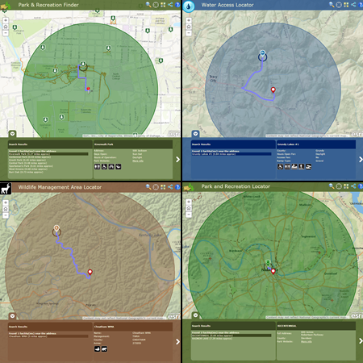

# configurable-place-finder

The Configurable Place Finder application is a configuration of ArcGIS for Server and a JavaScript application
that allows the public to locate parks, recreational opportunities boat ramps etc. in their community. This repo contains four unique configurations of the application Parks Finder, Parks Locator, Water Access Locator, and Wildlife Management Access Locator.

**Park and Recreation Finder** is a configuration of ArcGIS Server and a JavaScript application that allows citizens to locate park and recreation opportunities in their community
**Water Access Locator** is a configuration of ArcGIS for Server and a JavaScript API application that allows the public to locate boat ramps, and marinas, fishing sites in the state. 
**Wildlife Management Area Locator** is a configuration of ArcGIS and a JavaScript application that allows the public to locate Wildlife Management Areas (WMA) and huntable land in their state.
**Park and Recreation Locator** is a configuration of ArcGIS and JavaScript API application that allows the public to locate park and recreational opportunities in their state.. 

[Try the Parks Finder application](http://links.esri.com/localgovernment/tryit/ParksFinder/)

[Try the Parks Locator application](http://links.esri.com/stategovernment/tryit/ParksLocator/)

[Try the Water Access application](http://links.esri.com/stategovernment/tryit/WaterAccess/)

[Try the Wildlife Access Managment application](http://links.esri.com/stategovernment/tryit/WMA/)

## Features

* Search for a place by name, by current location, by address, or by activity
* Review activities at a given place and get directions to a place
* Share place information using social media

## Requirements

**Start now using Esri-supplied sample services**

You can start using the application now by setting it up on a web server running Microsoft Internet Information Services (IIS) and using sample services supplied by Esri.
You'll need to convert to an application in IIS and use the ASP .NET 4.0. application pool.

**Start now using your own services**

For more information on requirements and publication steps, see [Parks Locator](http://links.esri.com/stategovernment/help/10.2/ParkandRecreationLocator) help or [Water Access Locator](http://links.esri.com/stategovernment/help/10.2/WaterAccessLocator) help or [Wildlife Management Access](http://links.esri.com/stategovernment/help/10.2/WildlifeManagementAreaLocator) help or [Parks Finder](http://links.esri.com/localgovernment/help/10.2/ParksandRecreationFinder) help 

## Resources

Learn more about Esri's [ArcGIS for State and Local Government maps and apps](http://solutions.arcgis.com).

Show me a list of other [State and Local Government GitHub repositories](http://esri.github.io/#Government).

Additional [information and sample data](http://www.arcgis.com/home/item.html?id=e0b7b8889be24b60aed3455331eb25a6)
are available for the application.

This application uses the 3.11 version of
[Esri's ArcGIS API for JavaScript](http://help.arcgis.com/en/webapi/javascript/arcgis/);
see the site for concepts, samples, and a reference for using the API to create mapping web sites.

## Issues

Find a bug or want to request a new feature?  Please let us know by submitting an issue.

## Contributing

Esri welcomes contributions from anyone and everyone.
Please see our [guidelines for contributing](https://github.com/esri/contributing).

## Licensing

Copyright 2013 Esri

Licensed under the Apache License, Version 2.0 (the "License");
you may not use this file except in compliance with the License.
You may obtain a copy of the License at

   http://www.apache.org/licenses/LICENSE-2.0

Unless required by applicable law or agreed to in writing, software
distributed under the License is distributed on an "AS IS" BASIS,
WITHOUT WARRANTIES OR CONDITIONS OF ANY KIND, either express or implied.
See the License for the specific language governing permissions and
limitations under the License.

A copy of the license is available in the repository's
[LICENSE.txt](LICENSE.txt) file.

